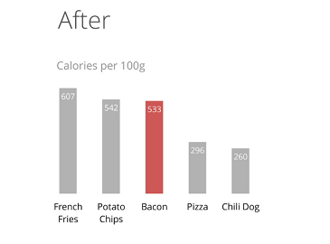

# Michigan Uni DS with Python
___
# Principle of Visualization
___

## Key Concepts
* Choose a graphic that displays misleading information
* Interpret the features of the graphic in order to identify the mechanism(s) that is/are used by the "encoder" to mislead the "decoder"
* Analyze the graphic and use principles from Alberto Cairo's work to explain how the graphic is misleading
* Create a radar plot in order to reflect on the complexity of the misleading graphic 

___
### **Tool for Thinking About Design**
#### **Alberto Cairo : The Functional Art**

- [**The Visualisation Wheel**](https://ryanwingate.com/visualization/guidelines/visualization-wheel/)

### **Dimension of Visualisation Wheel**
* Abstraction - Figuration
* Functionality - Decoration
* Density - Lightness
* Multidimensionality - Unidimensionality
* Orignality - Familiarity
* Novelty - Redundancy 

___
### **Data Ink Ratio (Edward Tufte)**
#### Edward Tufte : The visual display of Quantitative Information

- [The data ink ratio](https://speakerdeck.com/cherdarchuk/remove-to-improve-the-data-ink-ratio)  

    

**heuristic** is a process or rule that is meant to guide in decision making. 

- The chart junk  
    1. Unintended Optical Art
    2. Grid
    3. The Duck
    
#### Edward Tufte : The visual display of Quantitative Information

- The Spark line

- The Lie Factor

___

### **The Truthful Art : Alberto Cairo**

1. Truthful 
    - Not Misleading yourself
    - Not Misleading your audience
2. Funcionality 
3. Beauty
4. Insightful : aha or eureka moment 
5. Enlightning : Combination of above 4 and social ethical responsiblity

___

